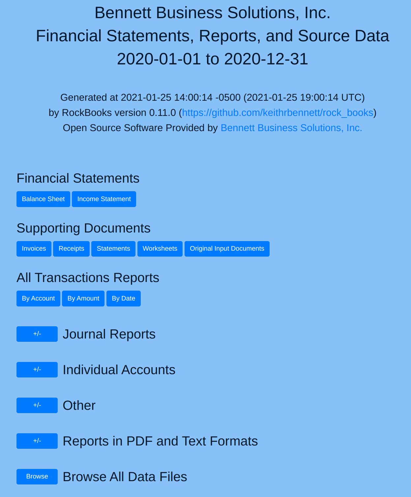

# Viewing the RockBooks Generated Reports

[[return to README](README.md)]

[Note to Accountants: Your client may send their tax information to you in the form of a zip file.
In order for the web links to work, it is necessary to unzip this file onto your system.
(That is, it is not enough to just click into the zip file in a file explorer.)]

## Viewing the Data

To view the generated reports and their supporting documents, you will need to open the file
`rockbooks_reports/html/index.html`. Using a file explorer (e.g. _Explorer_ on Windows or _Finder_ on Mac)
you can double-click `rockbook-reports`, then double-click `html`, then double-click `index.html`.
This should bring up a page looking something like this:



## ! Important Security Warning !

The generated HTML files are intended for local and individual use only. For your convenience, they contain links that enable you to navigate your data directories, but also your entire file system. _Making your files accessible via a web server or screen sharing would enable the remote user to view all the files on your system and is not recommended!_ You can give others access to your files safely by instead sending them only the data files, most conveniently in the form of a zip file.

## Vertical Line Spacing

In order to make the transactions easier to differentiate from each other, an extra new line is added to separate them. If you prefer not to have this extra new line (for example, to print the reports to paper more compactly), you can disable it using the "-e-" command line switch.

## Initially Submitted Data is Not Necessarily Final

When you initially submit your data to your accountant, he or she may offer corrections and suggestions. Be prepared to regenerate the reports after making any changes. It's easy to do; in a terminal, run `rock_books w` in the project data directory.

Assuming the accountant wants a zip file, in a terminal, run `zip -r my-data.zip .` (although this would work, it's probably better to specify the zip file in a different directory, e.g. `zip -r ~/temp/my-data.zip .`,  so that you don't include other backups in your backup). Alternatively you could use a GUI application to do the same. (In order to keep track of multiple versions of the data, I suggest including the date/time in the filename, e.g. `2021-01-25_17-32-02_2020-bbs-data.zip`.) 


## Supporting Documents

The "Supporting Documents" buttons merely link you to the corresponding directories extracted from the zip file. The "Original Input Documents" are the text files in which the client has recorded the transactions.

## Invoices and Receipts

There are buttons with which you can navigate the invoices and receipts directory trees (i.e. folders and subfolders). This can be useful, but the reports should contain appropriate links to invoices and receipts _per transaction_, and this might be how you prefer to view them.

## Beginning Account Balances

Currently the software does not differentiate between an account's initial balance and a transaction on the first day of a period. That is, there is no implementation of beginning balances; one simulates this by recording a transaction in the general journal on January 1st.

## HTML, PDF, and Text Formats

The simplest and most productive way to view the data is opening its `index.html` page in a web browser, but each report is also provided in text and PDF formats, in case that might be useful to you.

## Browsing the Files

If you want to view files _in addition to_ those already available with other buttons, you can click the `Browse` button next to `Browse All Data Files` at the bottom of the home page. This will display a listing of the data directory from its top. Here is a sample RockBooks data directory tree:

```
├── govt
├── invoices
├── misc
├── receipts
│   ├── 01
│   ├── 02
│   ├── 03
│   ├── 04
│   ├── 05
│   ├── 06
│   ├── 07
│   ├── 08
│   ├── 09
│   ├── 10
│   ├── 11
│   └── 12
├── rockbooks-inputs
├── rockbooks-reports
│   ├── html
│   │   └── single-account
│   ├── pdf
│   │   └── single-account
│   └── txt
│       └── single-account
├── statements
│   ├── pnc-checking
│   ├── pnc-visa
│   └── southwest-visa
└── worksheets
```

As an example of a useful directory that is not accessible via the other buttons, you can see a `govt` directory. This might be where the client has stored documents relating to business registration, licenses, etc.
